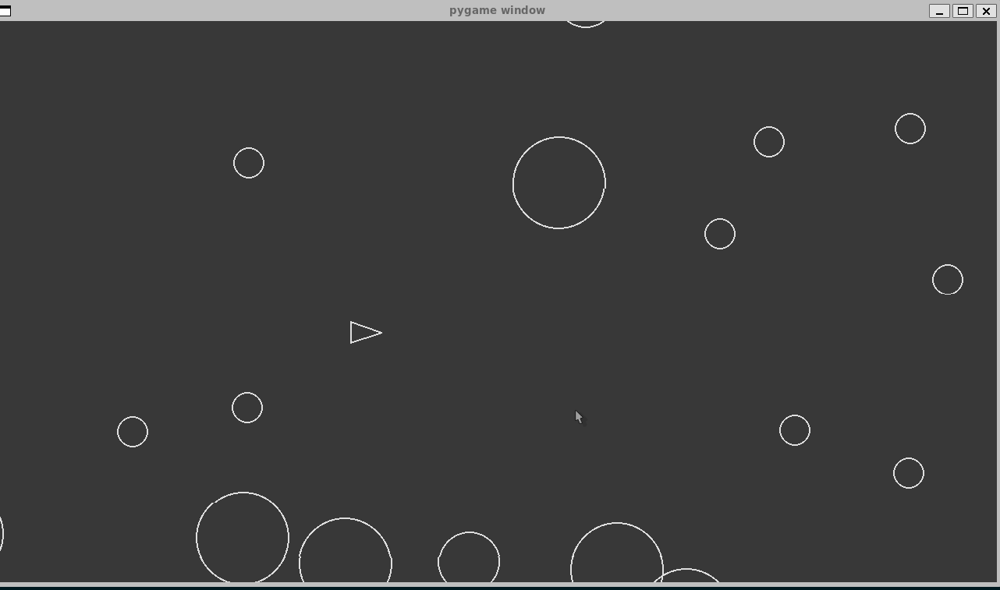

# Asteroids Game

This is a simple implementation of the classic Asteroids game using the Pygame library.



## Installation

1. Clone the repository:
    ```sh
    git clone https://github.com/emitrix/asteroids.git
    cd asteroids
    ```

2. Create a virtual environment and activate it:
    ```sh
    python3 -m venv venv
    source venv/bin/activate  # On Windows use `venv\Scripts\activate`
    ```

3. Install the required dependencies:
    ```sh
    pip install -r requirements.txt
    ```

## Usage

To start the game, run the `main.py` file:
```sh
python3 main.py
```

## Controls

- Use the asdw keys to move the player.
- Press the space bar to shoot.

## Game Description

- The player controls a spaceship in an asteroid field.
- The objective is to avoid collisions with asteroids and shoot them to split them into smaller pieces.
- The game ends when the player's spaceship collides with an asteroid.

## License

This project is open-source and available under the [MIT License](LICENSE).

## Acknowledgements

- This game uses the [Pygame](https://www.pygame.org/) library.
